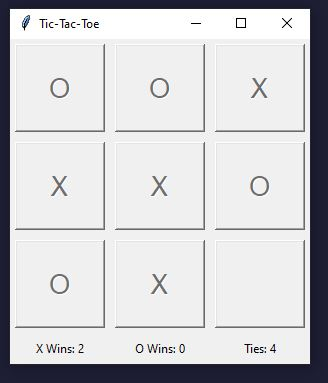

# TicTacToe-AI-MiniMax

    

## Game Overview

This simple Tic-Tac-Toe game allows you to play against a computer opponent. It features a graphical user interface (GUI) built using the Tkinter library in Python.

The game is a classic Tic-Tac-Toe matchup between the player (you) and the computer. The player marks their moves with 'O', and the computer marks its moves with 'X'. The goal is to form a straight line of three marks in a row, column, or diagonal.

## How to Play

To make a move, simply click on an empty cell in the 3x3 grid displayed on the GUI. The computer will then make its move, and the game proceeds until one player wins or the game ends in a tie.

## Key Features

- `User vs. User`: Play against another user.
- `User vs. AI computer (Easy Mode)`: Play against the computer with a simple AI opponent.
- `User vs. AI computer (Hard Mode)`: Play against the computer with a difficult AI opponent. In this mode the player will always have the first move.
- `User vs. AI computer (Hard Mode - Round Alternate`: Play against the computer with a difficult AI opponent. In this mode the rounds will alternate each round.
- `Graphical Interface`: Enjoy a visually appealing GUI built with Tkinter.
- `Game State Display`: Keep track of wins and ties with counters displayed on the GUI.

## Minimax Algorithm

In the Tic-Tac-Toe game application, the Minimax algorithm plays a crucial role in determining the computer opponent's moves. It enables the AI to make strategic decisions by evaluating all possible game states and selecting the move that maximizes its chances of winning or minimizes the chances of losing.

#### How it Works

1. `Recursive Tree Search`: The Minimax algorithm conducts a recursive tree search to explore possible moves and their outcomes. It creates a game tree representing all possible future game states, starting from the current state of the board.

2. `Evaluation Function`: At the terminal nodes of the tree, an evaluation function assesses the desirability of each game state. Winning positions are assigned a positive score, losing positions a negative score, and ties a neutral score.

3. `Minimization and Maximization`: As the algorithm traverses the tree, it alternates between minimizing and maximizing the potential scores. At each level of the tree, the computer player (maximizing player) aims to choose the move with the highest score, while the opponent (minimizing player) aims to choose the move with the lowest score.

4. `Backpropagation`: The optimal moves for each player are propagated upwards through the tree until the root is reached. This process ensures that the computer selects the best move for the current game state, considering all possible future outcomes.

#### Application in Tic-Tac-Toe

In the Tic-Tac-Toe game, the Minimax algorithm allows the computer opponent to assess the potential consequences of each move and select the move that leads to the best possible outcome. By exploring all possible moves and their consequences, the AI can make informed decisions to outmaneuver the human player and secure victory or force a draw.

#### Performance and Optimization

While Minimax guarantees optimal play in games with perfect information like Tic-Tac-Toe, its performance can be improved through optimizations such as alpha-beta pruning and depth-limited search. These techniques reduce the computational complexity of the algorithm, enabling faster and more efficient decision-making.

#### Conclusion

The Minimax algorithm empowers the computer opponent in the Tic-Tac-Toe game to play strategically and intelligently. By evaluating all possible moves and their outcomes, the AI can make informed decisions to maximize its chances of winning or secure a favorable outcome. This demonstrates the effectiveness of Minimax in adversarial environments and its application in creating challenging and engaging gameplay experiences.

## How to Run

Depending on which mode you want to play, run the game by executing the Python scripts `Tic_Tac_Toe_Two-Player.py`, `Tic_Tac_Toe_AI-EasyMode.py`, `Tic_Tac_Toe_AI-HardMode-Round-Alternate.py`, or`Tic_Tac_Toe_AI-HardMode.py`. Ensure you have Python installed on your system along with the Tkinter library, which is usually included with standard Python installations.

Game Mechanics
The game logic is handled by Python functions, with the Tkinter library used for GUI elements such as buttons and labels.
The AI opponent employs the minimax algorithm to make strategic moves.
Game results, including wins and ties, are displayed on the GUI for easy tracking.

## Developed Using:

